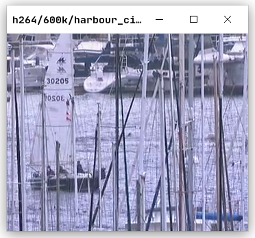

## 条件

为了公平起见，MPEG4 (codec 使用 libxvid) 和 H.264 (codec 使用 libx264) 均设置为：

1. 相邻 2 个 P/I 帧间插入 0 个 B 帧
2. 比特率为 300k/600k, 误差不超过 2k

## 比较

### 客观结果

从 MSE 和 PSNR 的结果来看，H.264比MPEG4的性能更好。

不同的序列的PSNR增益1dB到5dB不等，与视频内容相关。

## 比较 (300k)

| 文件名      | MSE   | MSE~Y~ | MSE~U~ | MSE~V~ | PSNR  | PSNR~Y~ | PSNR~U~ | PSNR~V~ |
|-------------|-------|--------|--------|--------|-------|---------|---------|---------|
| crew^m^     | 34.01 | 42.4   | 14.19  | 20.28  | 33.0  | 32.04   | 36.85   | 35.29   |
| crew^h^     | 22.63 | 29.15  | 7.93   | 11.24  | 34.72 | 33.62   | 39.29   | 37.77   |
| harbour^m^  | 99.6  | 146.04 | 8.51   | 4.92   | 28.22 | 26.56   | 38.84   | 41.22   |
| harbour^h^  | 60.06 | 87.35  | 6.58   | 4.36   | 30.38 | 28.75   | 39.96   | 41.76   |
| paris^m^    | 63.72 | 83.93  | 24.96  | 21.64  | 30.18 | 28.99   | 34.22   | 34.83   |
| paris^h^    | 17.62 | 22.81  | 7.23   | 7.24   | 35.92 | 34.82   | 39.65   | 39.64   |

## 比较 (600k)

| 文件名      | MSE   | MSE~Y~ | MSE~U~ | MSE~V~ | PSNR  | PSNR~Y~ | PSNR~U~ | PSNR~V~ |
|-------------|-------|--------|--------|--------|-------|---------|---------|---------|
| crew^m^     | 17.67 | 21.6   | 8.48   | 11.18  | 35.81 | 34.94   | 39.02   | 37.83   |
| crew^h^     | 11.4  | 14.06  | 5.4    | 6.76   | 37.72 | 36.8    | 40.97   | 40.02   |
| harbour^m^  | 54.32 | 78.54  | 7.42   | 4.34   | 30.83 | 29.23   | 39.44   | 41.77   |
| harbour^h^  | 31.91 | 45.68  | 5.26   | 3.49   | 33.14 | 31.59   | 40.94   | 42.73   |
| paris^m^    | 26.41 | 33.52  | 12.7   | 11.68  | 33.94 | 32.9    | 37.11   | 37.47   |
| paris^h^    | 7.14  | 8.89   | 3.67   | 3.59   | 39.79 | 38.85   | 42.59   | 42.69   |

## 比较

### 主观结果

除了客观的PSNR之外，下图是一些测试视频以 MPEG4 和 H.264 编码后的最后一帧的图像。

主观上能看到一些明显的块效应的减少。

## 比较 (300k)

{width=6cm}
{width=6cm}

## 比较 (300k)

{width=6cm}
{width=6cm}

## 比较 (300k)

{width=6cm}
{width=6cm}

## 比较 (600k)

{width=6cm}
{width=6cm}

## 比较 (600k)

{width=6cm}
{width=6cm}

## 比较 (600k)

{width=6cm}
{width=6cm}

## 比较

### 结论

目前的软件方案表明，无论是主观质量还是客观质量，H.264均表现出比MPEG4更好的编码性能。
