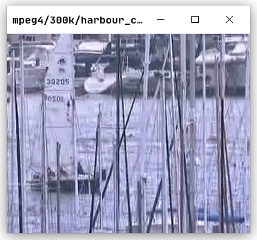
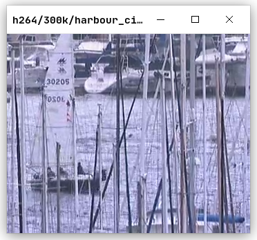
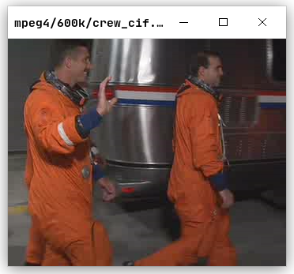

## 条件

为了公平起见，mpeg4 (codec 使用 libxvid) 和 h264 (codec 使用 libx264) 均设置为：

1. 相邻 2 个 P/I 帧间插入 3 个 B 帧
2. 比特率为 300k/600k, 误差不超过 2k

## 比较

### 客观结果

从 MSE 和 PSNR 的平均结果来看，h264 比 mpeg4 好一点。例如下表中^m^代表 mpeg4,
^h^代表 h264。MSE，PSNR 分别是负指标和正指标。下表代表在 Y，U，V 分别计算而不出
取平均的结果。

## 比较 (300k)

| 文件名      | MSE    | MSE~Y~ | MSE~U~ | MSE~V~ | PSNR  | PSNR~Y~ | PSNR~U~ | PSNR~V~ |
|-------------|--------|--------|--------|--------|-------|---------|---------|---------|
| crew^m^     | 271.59 | 371.97 | 47.48  | 94.19  | 24.6  | 23.26   | 32.27   | 29.2    |
| crew^h^     | 21.46  | 27.63  | 7.61   | 10.6   | 34.99 | 33.89   | 39.48   | 38.04   |
| deadline^m^ | 109.76 | 157.65 | 15.18  | 12.81  | 28.84 | 27.31   | 36.91   | 37.64   |
| deadline^h^ | 5.74   | 7.39   | 2.58   | 2.29   | 41.0  | 39.96   | 44.22   | 44.77   |
| harbour^m^  | 302.46 | 450.26 | 8.73   | 4.97   | 24.06 | 22.34   | 38.73   | 41.18   |
| harbour^h^  | 46.72  | 67.76  | 5.55   | 3.72   | 31.51 | 29.9    | 40.7    | 42.45   |
| pamphlet^m^ | 134.0  | 196.55 | 12.06  | 5.77   | 32.95 | 31.43   | 41.52   | 43.7    |
| pamphlet^h^ | 2.21   | 2.77   | 1.32   | 0.9    | 44.99 | 44.1    | 47.07   | 48.66   |

## 比较 (300k)

| 文件名      | MSE    | MSE~Y~ | MSE~U~ | MSE~V~ | PSNR  | PSNR~Y~ | PSNR~U~ | PSNR~V~ |
|-------------|--------|--------|--------|--------|-------|---------|---------|---------|
| paris^m^    | 180.86 | 255.22 | 35.34  | 28.97  | 25.8  | 24.33   | 32.71   | 33.6    |
| paris^h^    | 13.78  | 18.01  | 5.4    | 5.22   | 37.18 | 36.07   | 40.99   | 41.14   |
| silent^m^   | 108.5  | 157.04 | 12.8   | 10.01  | 28.38 | 26.8    | 37.28   | 38.34   |
| silent^h^   | 5.74   | 7.45   | 2.53   | 2.09   | 40.85 | 39.74   | 44.27   | 45.09   |
| students^m^ | 45.39  | 63.01  | 10.56  | 9.76   | 31.95 | 30.56   | 38.07   | 38.44   |
| students^h^ | 4.4    | 5.43   | 2.46   | 2.22   | 42.03 | 41.15   | 44.43   | 44.88   |

## 比较 (600k)

| 文件名      | MSE    | MSE~Y~ | MSE~U~ | MSE~V~ | PSNR  | PSNR~Y~ | PSNR~U~ | PSNR~V~ |
|-------------|--------|--------|--------|--------|-------|---------|---------|---------|
| crew^m^     | 277.31 | 380.52 | 47.17  | 94.6   | 24.53 | 23.18   | 32.39   | 29.25   |
| crew^h^     | 10.88  | 13.47  | 5.08   | 6.28   | 37.96 | 37.03   | 41.26   | 40.35   |
| deadline^m^ | 101.12 | 147.14 | 9.74   | 8.44   | 29.57 | 27.96   | 39.39   | 39.95   |
| deadline^h^ | 2.96   | 3.76   | 1.48   | 1.26   | 43.72 | 42.73   | 46.56   | 47.27   |
| harbour^m^  | 282.41 | 420.76 | 7.17   | 4.24   | 24.63 | 22.91   | 39.6    | 41.89   |
| harbour^h^  | 24.8   | 35.42  | 4.24   | 2.88   | 34.29 | 32.75   | 41.88   | 43.57   |
| pamphlet^m^ | 131.73 | 193.34 | 11.56  | 5.45   | 34.0  | 32.56   | 42.38   | 44.66   |
| pamphlet^h^ | 1.5    | 1.78   | 1.09   | 0.79   | 46.56 | 45.85   | 47.95   | 49.25   |

## 比较 (600k)

| 文件名      | MSE    | MSE~Y~ | MSE~U~ | MSE~V~ | PSNR  | PSNR~Y~ | PSNR~U~ | PSNR~V~ |
|-------------|--------|--------|--------|--------|-------|---------|---------|---------|
| paris^m^    | 159.96 | 228.98 | 24.22  | 19.66  | 26.5  | 24.97   | 34.39   | 35.39   |
| paris^h^    | 5.57   | 7.07   | 2.62   | 2.51   | 41.05 | 40.06   | 44.1    | 44.32   |
| silent^m^   | 104.59 | 152.45 | 9.79   | 7.96   | 28.61 | 26.99   | 38.53   | 39.44   |
| silent^h^   | 2.56   | 3.24   | 1.29   | 1.09   | 44.3  | 43.3    | 47.16   | 47.88   |
| students^m^ | 40.26  | 57.01  | 7.08   | 6.45   | 32.68 | 31.19   | 40.01   | 40.51   |
| students^h^ | 2.34   | 2.87   | 1.36   | 1.19   | 44.68 | 43.82   | 46.94   | 47.5    |

## 比较

### 主观结果

PSNR 只能衡量失真的程度，并不与人眼的观察感受完全一致。例如下图是一些测试视频以
mpeg4 和 h264 编码后的最后一帧的图像。

## 比较 (300k)

{width=6cm}
{width=6cm}

## 比较 (300k)

{width=6cm}
{width=6cm}

## 比较 (300k)

{width=6cm}
{width=6cm}

## 比较 (300k)

{width=6cm}
{width=6cm}

## 比较 (300k)

{width=6cm}
{width=6cm}

## 比较 (300k)

{width=6cm}
{width=6cm}

## 比较 (300k)

{width=6cm}
{width=6cm}

## 比较 (600k)

{width=6cm}
{width=6cm}

## 比较 (600k)

{width=6cm}
{width=6cm}

## 比较 (600k)

{width=6cm}
{width=6cm}

## 比较 (600k)

{width=6cm}
{width=6cm}

## 比较 (600k)

{width=6cm}
{width=6cm}

## 比较 (600k)

{width=6cm}
{width=6cm}

## 比较 (600k)

{width=6cm}
{width=6cm}

## 比较

### 结论

注意到 h264 主观上比 mpeg4 质量更好，建议更换为 h264 。
